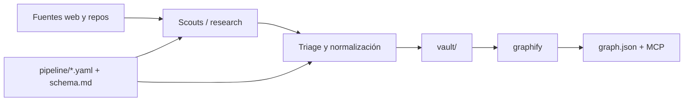

# Arquitectura

AI Brain separa el conocimiento curado de la maquinaria que lo produce. Esa frontera permite abrir
el vault sin herramientas de agentes y cambiar la orquestación sin migrar las notas.

## Capas

### 1. Configuración y contratos

`pipeline/` contiene las decisiones que deben compartir todos los clientes:

- `sources.yaml`: qué observar y con qué ventana temporal.
- `taxonomy.yaml`: vocabulario controlado.
- `schema.md`: contrato de las notas.
- `model-routing.yaml`: motores disponibles y criterios de selección.

Un prompt puede explicar cómo usar estos archivos, pero no debe copiar listas que luego puedan
quedar desactualizadas.

### 2. Orquestación

Los adaptadores de agentes convierten el contrato común en tareas ejecutables. La implementación
versionada actual vive en `.claude/`:

- `agents/`: scouts especializados y puente a motores externos.
- `skills/`: procedimientos interactivos.
- `workflows/`: fan-out, routing, triage y síntesis.

Esta capa puede tener adaptadores equivalentes para otros clientes. La compatibilidad se mantiene
leyendo `pipeline/` y escribiendo el mismo contrato de notas.

### 3. Base de conocimiento

`vault/` es el producto principal:

- `00_Inbox/`: evidencia cruda y temporal.
- `10_Daily/`: índice y resumen de una ejecución.
- `20_Items/`: conocimiento normalizado y reutilizable.
- `30_MOC/`: navegación temática.
- `40_Foundations/`: conceptos evergreen.
- `_templates/`: forma inicial de las notas.

El vault debe seguir siendo útil sin graphify ni un cliente de agentes.

### 4. Proyección de grafo

Graphify transforma el vault en `vault/graphify-out/`. Esa carpeta es una vista derivada:

- puede borrarse y regenerarse;
- no debe editarse a mano;
- no es fuente de verdad;
- el MCP consulta el `graph.json` generado, no modifica el vault.

## Invariantes

1. Toda faceta de un item existe en `pipeline/taxonomy.yaml`.
2. Toda nota de `20_Items/` cumple `pipeline/schema.md`.
3. Un asunto estable tiene una sola nota canónica.
4. `related` apunta a notas reales y crea relaciones intencionales.
5. Credenciales, worktrees y salidas regenerables permanecen fuera de Git.

## Estado local y generado

Se consideran locales o regenerables:

- `.env` y credenciales de CLIs;
- `.claude/worktrees/`;
- `.tmp/` y `.tmp-*/`;
- `vault/graphify-out/`;
- archivos `workspace*.json` de Obsidian.

Los ajustes compartidos de Obsidian que sí estén versionados deben cambiarse de forma intencional,
porque afectan a todos los clones.
